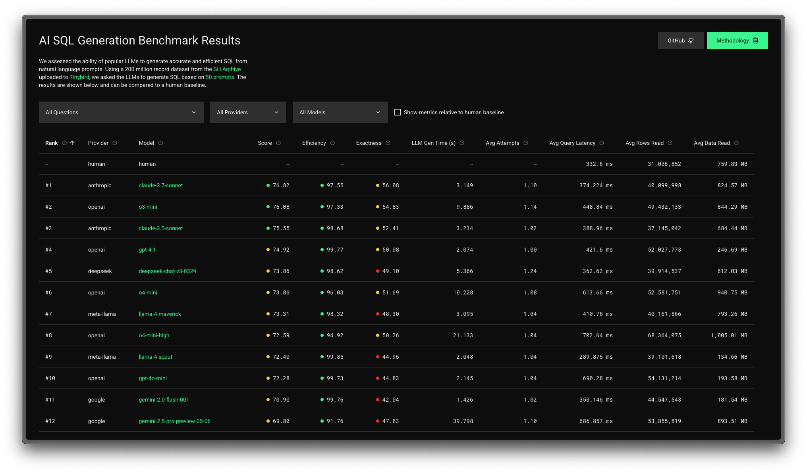

# LLM SQL Benchmark

A tool for benchmarking various Large Language Models (LLMs) on their ability to generate correct analytical SQL queries for Tinybird.

See results: https://llm-benchmark.tinybird.live/



## Overview

This benchmark evaluates how well different LLMs can generate analytical SQL queries based on natural language questions about data in Tinybird. It measures:

- SQL query correctness
- Execution success
- Performance metrics (time to first token, total duration, token usage)
- Error handling and recovery

The benchmark includes an automated retry mechanism that feeds execution errors back to the model for correction.

## Supported Providers & Models

The benchmark currently supports the following providers and models through [OpenRouter](https://openrouter.ai/):

- **Anthropic**: Claude 3.5 Sonnet, Claude 3.7 Sonnet
- **DeepSeek**: DeepSeek Chat v3
- **Google**: Gemini 2.0 Flash, Gemini 2.5 Flash/Pro
- **Meta**: Llama 4 Maverick/Scout, Llama 3.3 70B
- **Mistral**: Ministral 8B, Mistral Small 3.1, Mistral Nemo
- **OpenAI**: GPT-4.1, GPT-4.1 Nano, GPT-4o Mini, O3/O4 Mini

It can be extended to other models, see [how to benchmark a new model](#how-to-benchmark-a-new-model)

## Methodology

The benchmark is based on this [github_events](https://github.com/tinybirdco/llm-benchmark/blob/main/src/tinybird/datasources/github_events.datasource) table schema deployed to a [free Tinybird account](https://www.tinybird.co/pricing).

Corpus consists on 200M rows from the public [GitHub archive](https://www.gharchive.org/). For ease of ingestion they are provided as [Parquet files](https://storage.googleapis.com/dev-alrocar-public/github). Each file has 50M rows, so just 4 files are ingested for the benchmark. For this specific benchmark, scale is not critical, since we are comparing models among them and performance data can be easily extrapolated.

Each LLM must produce SQL from 50 natural language prompts or questions about public GitHub activity. You can find the whole list of questions in the `DESCRIPTION` of each Tinybird endpoint [here](https://github.com/tinybirdco/llm-benchmark/tree/main/src/tinybird/endpoints). Those endpoints are deployed to Tinybird to be used as a baseline for output correctness.

The [benchmark](https://github.com/tinybirdco/llm-benchmark/blob/96a738aafafbae32a0a72e6f149da7ebab452130/src/benchmark/index.ts#L181) is a node application that:

1. Runs the Tinybird endpoints to get a [results-human.json](https://github.com/tinybirdco/llm-benchmark/blob/main/src/benchmark/results-human.json) as output baseline.
2. Iterates a [list of models](https://github.com/tinybirdco/llm-benchmark/blob/main/src/benchmark-config.json) to extract SQL generation performance metrics.
3. Runs the generated queries and validates output correctness.

Each model receives a [system prompt](https://github.com/tinybirdco/llm-benchmark/blob/main/src/benchmark/prompt.ts) and the [github_events.datasource](https://github.com/tinybirdco/llm-benchmark/blob/main/src/tinybird/datasources/github_events.datasource) schema as context and must produce a SQL that returns an output when executed over the SQL API of Tinybird.

If the SQL produced is not valid, the LLM call is retried up to three times passing as context the error from the SQL API. Output is stored in a [results.json](https://github.com/tinybirdco/llm-benchmark/blob/main/src/benchmark/results.json) file.

Once all models have been iterated, `results-human.json` and `results.json` are compared to extract a metric for output correctness and stored in [validation-results.json](https://github.com/tinybirdco/llm-benchmark/blob/main/src/benchmark/validation-results.json).

Read this [blog post](https://tbrd.co/LKHKD7c) to learn more about how the benchmark measures output performance and correctness.

## Results presentation

Results produced by the benchmark are stored in json files and presented in a web application deployed to https://llm-benchmark.tinybird.live/

You can find the source code [here](https://github.com/tinybirdco/llm-benchmark/tree/main/src/src)

## How to benchmark a new model

Run the benchmark locally and extend it to any other model following these instructions.

### Prerequisites

- Node.js 18+ and npm
- OpenRouter API key
- Tinybird workspace token and API access

### Installation

1. Clone this repository
2. Install dependencies:

```bash
cd llm-benchmark/src
npm install
```

3. Prepare the Tinybird Workspace:

```bash
curl https://tinybird.co | sh
tb login
tb --cloud deploy
tb --cloud datasource append github_events https://storage.googleapis.com/dev-alrocar-public/github/01.parquet
```

3. Create a `.env` file with required credentials:

```
OPENROUTER_API_KEY=your_openrouter_api_key
TINYBIRD_WORKSPACE_TOKEN=your_tinybird_token
TINYBIRD_API_HOST=your_tinybird_api_host
```

### Usage

Run the benchmark:

```bash
npm run benchmark
```

This will:
1. Load the configured models from `benchmark-config.json`
2. Run each model against a set of predefined questions
3. Execute generated SQL queries against your Tinybird workspace
4. Store results in `benchmark/results.json`

### Test a new model

Edit `benchmark-config.json` to customize which providers and models to test.

## Results Analysis

Results are saved in JSON format with detailed information about each query inside the `benchmark` folder in this repository. To visualize the results you can start the Next.JS application:

```bash
cd llm-benchmark/src
npm install
npm run dev
```

## Attribution

The GitHub dataset used in this benchmark is based on work by:

Milovidov A., 2020. Everything You Ever Wanted To Know About GitHub (But Were Afraid To Ask), https://ghe.clickhouse.tech/

## Contributing

Contributions are welcome! Please feel free to submit a Pull Request. You can propose changes, extend the documentation, and share ideas by creating pull requests and issues on the GitHub repository.

## License

This project is open-source and available under the [CC-BY-4.0](https://creativecommons.org/licenses/by/4.0/) license or [Apache 2](https://www.apache.org/licenses/LICENSE-2.0) license. Attribution is required when using or adapting this content.
